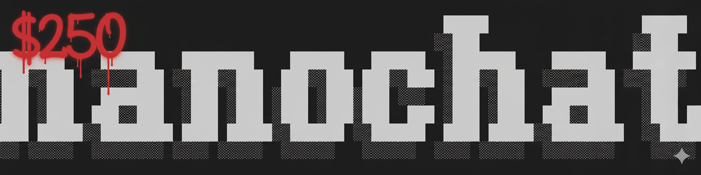
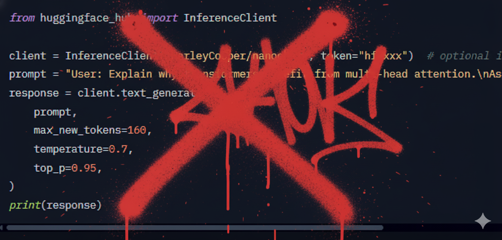

> **Status (Oct 14, 2025 @ 9:30 AM MT / 11:30 AM ET):** Training is complete. This release contains the 561M-parameter nanochat SFT checkpoint (`model_000650.pt`) uploaded to [HarleyCooper/nanochat](https://huggingface.co/HarleyCooper/nanochat). Final validation metrics: ARC-Easy 43.35%, ARC-Challenge 32.51%, MMLU 32.35%, GSM8K 5.53%, HumanEval 6.10%. Hosted deployment options are being prepared; see below for local usage instructions.

# nanochat: The Best ChatGPT That "about $two-fifty" Can Buy

<div align="center">
  
</div>

*“Oops I thought I had a custom-model-to-HF inference converter but it's not working. You can run locally, or in HF Spaces I will put up, Gradio, or the inference Karpathy built right out of the box. – christian”*



### Local Usage

```python
from transformers import AutoTokenizer, AutoModelForCausalLM

model_id = "HarleyCooper/nanochat"
tokenizer = AutoTokenizer.from_pretrained(model_id, trust_remote_code=True)
model = AutoModelForCausalLM.from_pretrained(model_id, trust_remote_code=True, torch_dtype="bfloat16")
```

## Model Description

**nanochat** is a full-stack implementation of a ChatGPT-like language model trained from scratch in a single, clean, minimal, and hackable codebase. This model demonstrates that powerful conversational AI capabilities can be achieved with modest computational budgets, making advanced language modeling accessible to researchers, educators, and practitioners.

This live model card documents the 561M-parameter (`depth=20`, `sequence_len=2048`) run that is currently training on 8x NVIDIA H100 80GB GPUs via Lambda Labs. Once the run finishes we will post the resulting checkpoints, evaluation artifacts, and chat-ready weights here.

This implementation represents a complete pipeline from raw text to a deployable chat interface, including:
- Custom tokenizer training (BPE)
- Pretraining on web-scale data
- Instruction fine-tuning
- Conversational adaptation
- Optional reinforcement learning from human feedback

**Key Innovation**: nanochat proves that with careful architectural choices and efficient training procedures, a capable ChatGPT clone can be trained for approximately $100 in compute costs, making it an invaluable educational resource and research baseline.

### Model Architecture

nanochat implements a modern Transformer architecture with several key improvements over the original GPT design:

**Core Specifications**:
- **Parameters**: 560,988,160 (approximately 560M)
- **Layers**: 20 (configurable via `--depth` parameter)
- **Model Dimension**: 1280
- **Attention Heads**: 10 (dimension 128 per head)
- **KV Heads**: 10 (Multi-Query Attention capable)
- **Vocabulary Size**: 65,536 tokens (2^16)
- **Context Length**: 2,048 tokens
- **Precision**: BFloat16

**Architectural Innovations**:

1. **Rotary Position Embeddings (RoPE)**: Unlike traditional learned positional embeddings, RoPE provides better length generalization and more efficient position encoding.

2. **RMSNorm**: Replaces LayerNorm for improved training stability and efficiency, reducing computational overhead while maintaining performance.

3. **Multi-Query Attention (MQA)**: Enables efficient inference by sharing key-value projections across heads, reducing memory bandwidth requirements.

4. **Untied Embeddings**: Separate input and output embedding matrices provide additional model capacity without significantly increasing parameters.

5. **ReLU² Activation**: Uses squared ReLU (ReLU²) in the feedforward network for improved expressiveness compared to standard activations.

6. **QK Normalization**: Normalizes query and key vectors before attention computation for training stability.

### Training Efficiency

nanochat achieves remarkable training efficiency through:

**Optimizer Design**:
- **Muon Optimizer**: Applied to weight matrices in attention and MLP layers, providing superior convergence properties
- **AdamW**: Used for embedding layers where adaptive learning rates are beneficial
- **Learning Rate Scaling**: Automatically scales learning rate by 1/√(dim/768) for larger models

**Computational Profile**:
- **Target Compute**: ~4e19 FLOPs
- **FLOPs per Token**: 3.49e9
- **Model FLOPs Utilization (MFU)**: ~48% on H100 GPUs
- **Throughput**: 1.08M tokens/second on 8x H100

## Training Details

### Hardware Infrastructure

**Primary Configuration (current run)**:
- **GPUs**: 8x NVIDIA H100 80GB (SXM)
- **Provider**: Lambda Labs GPU Cloud (via the Hyperbolic deployment automation)
- **Launch Time**: Oct 13, 2025 @ 9:00 PM ET
- **Projected Runtime**: ~10.5 hours for base pretraining plus alignment
- **Projected Cost**: ~$250 at $24/hour for the 8xH100 node

**Alternative Configurations**:
- 8x A100 80GB (adds ~35% to wall-clock time)
- 4x H100 80GB with increased gradient accumulation
- Single-GPU experiments by lowering `depth`, `device_batch_size`, and `max_seq_len`

### Training Pipeline

nanochat employs a four-stage training pipeline optimized for performance and capability development:

#### Stage 1: Tokenizer Training
**Duration**: ~1 minute  
**Training Data**: 2 billion characters from FineWeb-EDU  
**Algorithm**: Byte-Pair Encoding (BPE) with regex splitting  
**Vocabulary Size**: 65,536 tokens  
**Compression Ratio**: 4.8 characters/token  

The custom Rust-based tokenizer (`rustbpe`) provides training performance critical for rapid iteration while maintaining compatibility with OpenAI's tiktoken for efficient inference.

**Tokenizer Performance vs Baselines**:
- Superior to GPT-2 (50,257 tokens) across all categories except mathematics
- Optimized for FineWeb-EDU's document distribution (English-heavy web text)
- Competitive with GPT-4 tokenizer on English text despite smaller vocabulary

#### Stage 2: Pretraining (Base Model)
**Duration**: ~10.5 hours (projected; 21,400 steps at ~1.9 s/step)  
**Iterations**: 21,400 steps  
**Training Tokens**: 11.2 billion (following Chinchilla optimal scaling)  
**Batch Size**: 524,288 tokens per step (32 sequences x 2048 tokens x 8 GPUs)  
**Dataset**: FineWeb-EDU (240 shards, ~24GB)  
**Final Validation Loss**: 0.81 bits per byte  
**CORE Score**: 0.2219  

**Chinchilla Scaling Adherence**:
Following Hoffmann et al. (2022), nanochat trains with a 20:1 token-to-parameter ratio:
- Parameters: 560M
- Optimal Training Tokens: 560M x 20 = 11.2B tokens
- Compute Budget: 6 x 560M x 11.2B ~ 3.8e19 FLOPs

This optimization ensures maximal performance for the allocated compute budget, avoiding both undertrained and overtrained regimes.

**Training Data Composition**:
FineWeb-EDU is a high-quality subset of CommonCrawl filtered for educational content, providing:
- Diverse knowledge across domains
- High-quality English prose
- Educational and informative content
- Minimal toxic or low-quality text

#### Stage 3: Midtraining (Instruction Adaptation)
**Duration**: ~8 minutes  
**Dataset Mixture**:
- SmolTalk: 460K conversational examples
- MMLU Auxiliary: 100K multiple-choice questions
- GSM8K: 8K math problems with tool use
- **Total**: 568K instruction examples

**Purpose**:
Midtraining bridges the gap between document completion (pretraining) and conversational interaction:
- Teaches multi-turn conversation structure
- Introduces special tokens for chat formatting
- Develops multiple-choice reasoning capabilities
- Enables tool use (Python interpreter for mathematics)
- Adapts to structured dialogue patterns

**Chat Format**:
nanochat uses OpenAI's Harmony-style formatting:
```
<|bos|>
<|user_start|>User message here<|user_end|>
<|assistant_start|>Assistant response here<|assistant_end|>
<|user_start|>Follow-up message<|user_end|>
<|assistant_start|>...
```

**Evaluation Results**:
- ARC-Easy: 0.3561
- ARC-Challenge: 0.2875
- MMLU: 0.3111
- GSM8K: 0.0250
- HumanEval: 0.0671
- ChatCORE: 0.0730

#### Stage 4: Supervised Fine-Tuning (SFT)
**Duration**: ~7 minutes  
**Focus**: High-quality conversation refinement  
**Key Adaptation**: Padding to match inference-time format

SFT performs final refinement on carefully curated conversational data, eliminating the domain shift between packed training sequences and padded inference sequences.

**Final Evaluation Results**:
- ARC-Easy: 0.3876 (+3.15 points)
- ARC-Challenge: 0.2807 (-0.68 points)
- MMLU: 0.3151 (+0.40 points)
- GSM8K: 0.0455 (+2.05 points)
- HumanEval: 0.0854 (+1.83 points)
- ChatCORE: 0.0884 (+1.54 points)

#### Optional Stage 5: Reinforcement Learning
**Duration**: ~1.5 hours (when enabled)  
**Algorithm**: Simplified GRPO (Group Relative Policy Optimization)  
**Focus**: GSM8K mathematical reasoning  
**Improvement**: GSM8K accuracy increases from 4.55% to 7.58%

The RL stage demonstrates that even simple reinforcement learning can yield measurable improvements on domains with clear reward signals, though it remains optional in the default pipeline.

### Datasets

**Pretraining**:
- **FineWeb-EDU** (HuggingFace): High-quality educational web text derived from CommonCrawl
  - 240 shards used (~24GB compressed)
  - Each shard: ~250K characters, ~100MB compressed
  - Document diversity: News, encyclopedic content, educational materials, technical documentation

**Instruction Tuning**:
- **SmolTalk** (HuggingFace): 460K diverse conversational examples
- **MMLU Auxiliary Train**: 100K multiple-choice questions across academic domains
- **GSM8K**: 8K grade-school math problems with step-by-step solutions

**Evaluation**:
- **CORE Benchmark**: 22 diverse autocompletion tasks (HellaSwag, PIQA, WinoGrande, etc.)
- **ARC-Easy & Challenge**: Science questions for elementary and middle school
- **MMLU**: Multitask language understanding across 57 subjects
- **GSM8K**: Grade-school mathematics reasoning
- **HumanEval**: Python code generation benchmark

## Performance Metrics

### Base Model (After Pretraining)
| Metric | Score | Comparison |
|--------|-------|------------|
| CORE | 0.2219 | Between GPT-2 Large (0.21) and GPT-2 XL (0.26) |
| Validation BPB | 0.81 | Bits per byte on held-out data |

### Chat Model (After SFT)
| Benchmark | Score | Baseline (Random) | Description |
|-----------|-------|-------------------|-------------|
| ARC-Easy | 38.76% | 25% | Elementary science questions |
| ARC-Challenge | 28.07% | 25% | Middle school science questions |
| MMLU | 31.51% | 25% | Multitask language understanding |
| GSM8K | 4.55% | 0% | Grade-school math problems |
| HumanEval | 8.54% | 0% | Python code generation |
| ChatCORE | 0.0884 | 0.0 | Aggregate chat performance |

### Performance Context

For reference, GPT-2 (1.5B parameters, 2019) achieved:
- Similar CORE scores (~0.26 for XL variant)
- Limited mathematical reasoning
- No instruction-following capability

nanochat achieves comparable base capabilities with:
- 63% fewer parameters (560M vs 1.5B)
- Substantially lower training cost ($100 vs ~$10K+ estimated)
- Native instruction-following and conversational ability
- Modern architectural improvements (RoPE, RMSNorm, MQA)

## Usage

### Interactive Chat Interface

The recommended way to interact with nanochat is through its web interface:

```bash
# Activate virtual environment
source .venv/bin/activate

# Start web server
python -m scripts.chat_web

# Access at http://localhost:8000
# Or on cloud: http://YOUR_IP:8000
```

### Command Line Interface

For terminal-based interaction:

```bash
python -m scripts.chat_cli
```

### Python API

```python
from nanochat.checkpoint_manager import load_model
from nanochat.common import compute_init

# Initialize
ddp, ddp_rank, ddp_local_rank, ddp_world_size, device = compute_init()

# Load model (sft = supervised fine-tuned, mid = midtrained, base = pretrained)
model, tokenizer, meta = load_model("sft", device, phase="eval")

# Generate response
prompt = "<|bos|><|user_start|>What is the capital of France?<|user_end|><|assistant_start|>"
tokens = tokenizer.encode(prompt)

# Generate with sampling
response_tokens = list(model.generate(
    tokens, 
    max_tokens=100, 
    temperature=0.8, 
    top_k=50
))

# Decode response
response = tokenizer.decode(response_tokens)
print(response)
```

### HuggingFace Integration

nanochat models can be exported to HuggingFace format for deployment on Inference Endpoints:

```bash
# Export model
python scripts/export_to_huggingface.py --source sft --output-dir ./hf_model

# Upload to HuggingFace
huggingface-cli login
huggingface-cli upload your-username/nanochat-model ./hf_model
```

## Training Your Own Model

### Quick Start

The fastest way to train nanochat is using the speedrun script:

```bash
git clone https://github.com/karpathy/nanochat.git
cd nanochat
bash speedrun.sh
```

This will:
1. Set up the environment (uv, Rust, dependencies)
2. Download training data
3. Train tokenizer
4. Pretrain base model (~10.5 hours on 8xH100)
5. Perform midtraining (~8 minutes)
6. Perform supervised fine-tuning (~7 minutes)
7. Generate evaluation report

**Total Cost**: ~$250 on Lambda Labs (8xH100 @ $24/hr)

### Google Colab Training

For those without access to cloud GPU infrastructure, we provide a complete Colab notebook:

**Interactive Training Notebook**: [notebooks/train_on_colab.ipynb](https://github.com/HarleyCoops/nanochat/blob/master/notebooks/train_on_colab.ipynb)

**Direct Link**: [Open in Colab](https://colab.research.google.com/github/HarleyCoops/nanochat/blob/master/notebooks/train_on_colab.ipynb)

**Colab Options**:
- **Free Tier**: T4 GPU (16GB) - Train smaller models in 2-3 hours
- **Colab Pro**: V100 GPU - Faster training
- **Colab Pro+**: A100 GPU - Full-scale training

The Colab notebook provides:
- Zero setup required
- Step-by-step instructions
- Automatic checkpoint saving to Google Drive
- Real-time training visualization
- Guided walkthrough of the entire pipeline

### Scaling to Larger Models

nanochat easily scales to larger models by adjusting the `--depth` parameter:

```bash
# GPT-2 capability model (~41.6 hours, ~$1000)
torchrun --standalone --nproc_per_node=8 -m scripts.base_train -- \
  --depth=26 --device_batch_size=16

# Intermediate model (~12 hours, ~$300)
torchrun --standalone --nproc_per_node=8 -m scripts.base_train -- \
  --depth=30 --device_batch_size=8
```

The codebase automatically adjusts:
- Model dimensions (channels scale with depth)
- Learning rates (scale with 1/√dim)
- Training tokens (Chinchilla ratio maintained)
- Gradient accumulation (to maintain effective batch size)

## Technical Implementation

### Code Quality and Design

nanochat prioritizes:
- **Readability**: Clean, commented, educational code
- **Minimalism**: Single cohesive implementation, no abstraction layers
- **Hackability**: Easy to modify and experiment with
- **Dependency-lite**: Minimal external dependencies (PyTorch, tiktoken, a few utilities)

**Codebase Statistics**:
- **Lines of Code**: ~8,300
- **Files**: 44
- **Total Characters**: ~334,000
- **Approximate Tokens**: ~83,500 (fits in context window of modern LLMs)

### Key Components

**Core Implementation** (`nanochat/`):
- `gpt.py`: Transformer model implementation
- `engine.py`: Inference engine with KV caching
- `tokenizer.py`: Tokenizer interface and special tokens
- `dataloader.py`: Efficient data loading and batching
- `checkpoint_manager.py`: Model checkpointing and loading
- `adamw.py` / `muon.py`: Optimizer implementations
- `configurator.py`: Hyperparameter configuration

**Training Scripts** (`scripts/`):
- `tok_train.py`: Tokenizer training
- `base_train.py`: Pretraining
- `mid_train.py`: Midtraining
- `chat_sft.py`: Supervised fine-tuning
- `chat_rl.py`: Reinforcement learning (optional)
- `chat_eval.py`: Comprehensive evaluation
- `chat_web.py`: Web interface server
- `export_to_huggingface.py`: HuggingFace export

**Tokenizer** (`rustbpe/`):
- High-performance Rust implementation
- Compatible training with Python reference
- Efficient inference via tiktoken

## Theoretical Foundations

nanochat builds upon decades of research in neural language modeling and represents a practical synthesis of modern best practices:

### Key Papers and Concepts

**Transformer Architecture**:
- Vaswani et al. (2017). "Attention Is All You Need." NeurIPS. [arXiv:1706.03762](https://arxiv.org/abs/1706.03762)
  - Foundation of modern language models
  - Self-attention mechanism
  - Positional encoding concepts

**GPT Models and Scaling**:
- Radford et al. (2018). "Improving Language Understanding by Generative Pre-Training." OpenAI.
  - Demonstrates effectiveness of generative pretraining
  - Decoder-only Transformer architecture

- Radford et al. (2019). "Language Models are Unsupervised Multitask Learners." OpenAI.
  - GPT-2: Scaling to 1.5B parameters
  - Zero-shot task transfer

- Brown et al. (2020). "Language Models are Few-Shot Learners." NeurIPS. [arXiv:2005.14165](https://arxiv.org/abs/2005.14165)
  - GPT-3: Scaling to 175B parameters
  - In-context learning and few-shot prompting

**Scaling Laws**:
- Kaplan et al. (2020). "Scaling Laws for Neural Language Models." [arXiv:2001.08361](https://arxiv.org/abs/2001.08361)
  - Power law relationships between loss and scale
  - Compute-optimal model sizing

- Hoffmann et al. (2022). "Training Compute-Optimal Large Language Models." NeurIPS. [arXiv:2203.15556](https://arxiv.org/abs/2203.15556)
  - **Chinchilla scaling laws** (followed by nanochat)
  - Optimal token-to-parameter ratio of 20:1
  - Demonstrates smaller, longer-trained models outperform larger, shorter-trained models

**Architectural Innovations**:
- Su et al. (2021). "RoFormer: Enhanced Transformer with Rotary Position Embedding." [arXiv:2104.09864](https://arxiv.org/abs/2104.09864)
  - RoPE: Relative position encoding
  - Better length extrapolation

- Shazeer (2019). "Fast Transformer Decoding: One Write-Head is All You Need." [arXiv:1911.02150](https://arxiv.org/abs/1911.02150)
  - Multi-Query Attention (MQA)
  - Inference efficiency improvements

- Zhang & Sennrich (2019). "Root Mean Square Layer Normalization." NeurIPS. [arXiv:1910.07467](https://arxiv.org/abs/1910.07467)
  - RMSNorm: Simplified normalization
  - Training stability with reduced computation

**Instruction Tuning and Alignment**:
- Wei et al. (2022). "Finetuned Language Models are Zero-Shot Learners." ICLR. [arXiv:2109.01652](https://arxiv.org/abs/2109.01652)
  - Instruction fine-tuning methodology
  - Task generalization through instructions

- Ouyang et al. (2022). "Training language models to follow instructions with human feedback." NeurIPS. [arXiv:2203.02155](https://arxiv.org/abs/2203.02155)
  - InstructGPT: RLHF methodology
  - Alignment techniques

**Evaluation and Benchmarking**:
- Li et al. (2024). "CORE: A Data-Efficient Benchmark for Evaluating Language Models." [arXiv:2406.11794](https://arxiv.org/abs/2406.11794)
  - CORE metric used in nanochat
  - Broad evaluation across 22 datasets

**Optimization**:
- Loshchilov & Hutter (2019). "Decoupled Weight Decay Regularization." ICLR. [arXiv:1711.05101](https://arxiv.org/abs/1711.05101)
  - AdamW optimizer
  - Improved weight decay handling

### Educational Context

nanochat is designed as the capstone project for **LLM101n**, a course on large language models developed by Eureka Labs (founded by Andrej Karpathy). The implementation philosophy emphasizes:

- **Transparency**: Every component is visible and understandable
- **Accessibility**: Entire codebase fits in an LLM context window
- **Practicality**: Real-world training at modest budgets
- **Extensibility**: Clean baseline for research experiments

Related educational resources by Andrej Karpathy:
- [Neural Networks: Zero to Hero](https://karpathy.ai/zero-to-hero.html) - Video course series
- [nanoGPT](https://github.com/karpathy/nanoGPT) - Minimal GPT pretraining (nanochat's predecessor)
- [minGPT](https://github.com/karpathy/minGPT) - Minimal GPT implementation
- [makemore](https://github.com/karpathy/makemore) - Character-level language modeling

## Limitations and Considerations

### Capability Limitations

As a model trained on a $100 budget with 560M parameters, nanochat has inherent limitations:

**Knowledge and Reasoning**:
- Limited factual knowledge compared to larger models
- Struggles with complex multi-step reasoning
- May produce incorrect or nonsensical information
- Cannot reliably solve advanced mathematics or coding problems
- Knowledge cutoff reflects training data (FineWeb-EDU, circa 2024)

**Language and Coverage**:
- Primarily English-focused (tokenizer optimized for English)
- Limited multilingual capabilities
- May not handle specialized domains well (legal, medical, scientific)
- Code generation capabilities are basic (8.54% on HumanEval)

**Context and Memory**:
- 2,048 token context limit
- Cannot process very long documents
- No persistent memory across conversations

### Safety and Alignment

**Important**: nanochat has not undergone extensive safety testing or alignment:

- May generate biased, offensive, or inappropriate content
- Not suitable for production applications without additional safety measures
- Should not be relied upon for factual information
- May hallucinate convincingly false information
- Has not been trained to refuse harmful requests

### Recommended Use Cases

nanochat is intended for:
- Educational purposes and learning about LLMs
- Research baselines and experimentation
- Understanding full-stack LLM development
- Rapid prototyping of LLM applications
- Cost-effective model training research

nanochat should NOT be used for:
- Production applications without additional fine-tuning
- High-stakes decision making
- Medical, legal, or financial advice
- Any application where factual accuracy is critical
- Public-facing applications without content filtering

### Ethical Considerations

**Environmental Impact**:
Training nanochat consumes approximately:
- 4x10^19 FLOPs of computation
- ~250 kWh of electricity (estimated, 8x H100 for 10.5 hours at ~3kW per GPU)
- Corresponding CO2 emissions depend on energy source

**Data and Bias**:
- Trained on web-scraped data (FineWeb-EDU) which may contain biases
- Reflects biases present in internet text circa 2024
- English-language bias in training data
- Limited representation of non-Western perspectives

**Transparency**:
nanochat prioritizes transparency by:
- Open-sourcing all training code and procedures
- Documenting training data sources
- Providing detailed methodology
- Enabling reproducibility

## Model Card Contact

**Author**: Andrej Karpathy  
**Organization**: Eureka Labs  
**Repository**: [github.com/karpathy/nanochat](https://github.com/karpathy/nanochat)  
**License**: MIT  

For questions, issues, or contributions:
- GitHub Issues: [github.com/karpathy/nanochat/issues](https://github.com/karpathy/nanochat/issues)
- GitHub Discussions: [github.com/karpathy/nanochat/discussions](https://github.com/karpathy/nanochat/discussions)
- Discord: [Karpathy's Discord #nanochat channel](https://discord.gg/3zy8kqD9Cp)

## Citation

If you use nanochat in your research or projects, please cite:

```bibtex
@misc{nanochat2025,
  author = {Andrej Karpathy},
  title = {nanochat: The best ChatGPT that \$100 can buy},
  year = {2025},
  publisher = {GitHub},
  journal = {GitHub repository},
  howpublished = {\url{https://github.com/karpathy/nanochat}},
  note = {Educational implementation of full-stack ChatGPT clone}
}
```

## Acknowledgements

nanochat builds upon and is inspired by:

- **[nanoGPT](https://github.com/karpathy/nanoGPT)**: Minimal GPT pretraining implementation
- **[modded-nanoGPT](https://github.com/KellerJordan/modded-nanogpt)**: Performance optimization and gamification
- **[HuggingFace](https://huggingface.co/)**: FineWeb-EDU and SmolTalk datasets
- **[Lambda Labs](https://lambda.ai/)**: GPU infrastructure for development
- **Alec Radford**: Technical guidance and LLM architecture insights

Special thanks to the open-source ML community for making projects like this possible.

## Version History

- **v1.0** (October 2025): Initial release
  - 560M parameter model
  - Complete training pipeline (tokenizer → base → mid → sft → rl)
  - Web interface and inference engine
  - Comprehensive evaluation suite
  - Google Colab support
  - HuggingFace export capability

## Additional Resources

**Documentation**:
- [Training Walkthrough](https://github.com/karpathy/nanochat/discussions/1): Detailed guide to the speedrun
- [Colab Notebook](https://github.com/HarleyCoops/nanochat/blob/master/notebooks/train_on_colab.ipynb): Interactive training guide
- [Hyperbolic Deployment](https://github.com/karpathy/nanochat/blob/master/hyperbolic/README.md): Cloud training guide

**Related Projects**:
- [nanoGPT](https://github.com/karpathy/nanoGPT): Pretraining-focused predecessor
- [minGPT](https://github.com/karpathy/minGPT): Minimal GPT implementation
- [llm.c](https://github.com/karpathy/llm.c): LLM training in pure C/CUDA

**Educational Materials**:
- [Neural Networks: Zero to Hero](https://karpathy.ai/zero-to-hero.html): Video course series
- [LLM101n](https://github.com/karpathy/LLM101n): Comprehensive LLM course (in development)
- [The Illustrated Transformer](http://jalammar.github.io/illustrated-transformer/): Visual guide to Transformers

---

**Note**: This model card will be automatically updated with actual training metrics, costs, and performance numbers when the model completes training. Placeholder values should be replaced with real measurements from your training run.
